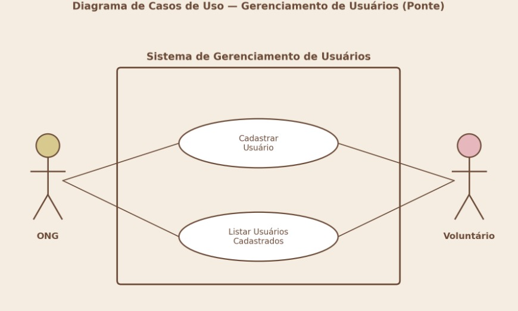
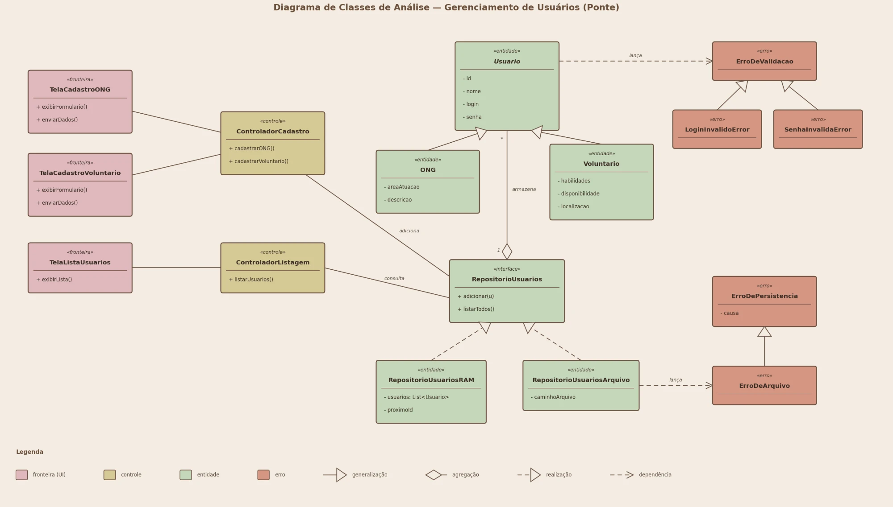

# Módulo: Gerenciamento de Usuários

Escopo da Sprint 1. Cobre o cadastro e a listagem dos dois tipos de usuário do sistema (ONG e Voluntário), correspondendo a um subconjunto de [UC01 e UC02](./casos-de-uso.md) focado nos casos de uso de ADIÇÃO e LISTAGEM de usuários.

## Diagrama de Casos de Uso

Dois atores, **ONG** e **Voluntário**, compartilham os dois casos de uso do módulo:

- **Cadastrar Usuário** — cadastro de uma ONG (UC01) ou de um Voluntário (UC02).
- **Listar Usuários Cadastrados** — consulta de todos os usuários já cadastrados no sistema.

## Diagrama de Classes de Análise

Organização em três camadas (padrão fronteira/controle/entidade):

- **Fronteira:** `TelaCadastroONG`, `TelaCadastroVoluntario`, `TelaListaUsuarios` — telas de UI, ainda não implementadas (dependem da stack de interface a ser definida).
- **Controle:** `ControladorCadastro` (`cadastrarONG()`, `cadastrarVoluntario()`), `ControladorListagem` (`listarUsuarios()`).
- **Entidade:** `Usuario` (base, com `id` e `nome`), `ONG` (`areaAtuacao`, `descricao`) e `Voluntario` (`habilidades`, `disponibilidade`, `localizacao`) como subclasses; `RepositorioUsuarios` armazena (agregação `1..*`) os usuários e expõe `adicionar(u)` e `listarTodos()`.

## Regras de negócio aplicadas

- **RN01** — uma ONG só é cadastrada com nome, área de atuação e descrição preenchidos.
- **RN02** — um voluntário só é cadastrado com nome, habilidades, disponibilidade e localização preenchidos.

## Persistência

Nesta sprint, a persistência é uma coleção em memória RAM (`RepositorioUsuarios`), sem banco de dados — os dados são perdidos ao reiniciar o processo. A troca por uma persistência durável (arquivo, banco de dados) é um requisito de sprint futura e não deve alterar os contratos públicos de `ControladorCadastro` / `ControladorListagem` sem um novo ADR (ver seção 6 do `CONTRIBUTING.md`).

## Mapeamento para o código

| Elemento do diagrama | Implementação |
|---|---|
| `Usuario` | [`src/entidades/Usuario.ts`](../../src/entidades/Usuario.ts) |
| `ONG` | [`src/entidades/Ong.ts`](../../src/entidades/Ong.ts) |
| `Voluntario` | [`src/entidades/Voluntario.ts`](../../src/entidades/Voluntario.ts) |
| `RepositorioUsuarios` | [`src/entidades/RepositorioUsuarios.ts`](../../src/entidades/RepositorioUsuarios.ts) — interface, ver nota abaixo |
| `ControladorCadastro` | [`src/controle/ControladorCadastro.ts`](../../src/controle/ControladorCadastro.ts) |
| `ControladorListagem` | [`src/controle/ControladorListagem.ts`](../../src/controle/ControladorListagem.ts) |
| `TelaCadastroONG`, `TelaCadastroVoluntario`, `TelaListaUsuarios` | Pendente — camada `fronteira` aguardando definição da stack de UI. |

> **Atualização (Laboratório 2):** `Usuario` ganhou credenciais (`login`/`senha`) validadas por exceções próprias, e `RepositorioUsuarios` virou uma interface com duas implementações (RAM e arquivo binário). Ver [tratamento-erros-persistencia.md](./tratamento-erros-persistencia.md) para o diagrama atualizado e os detalhes.
