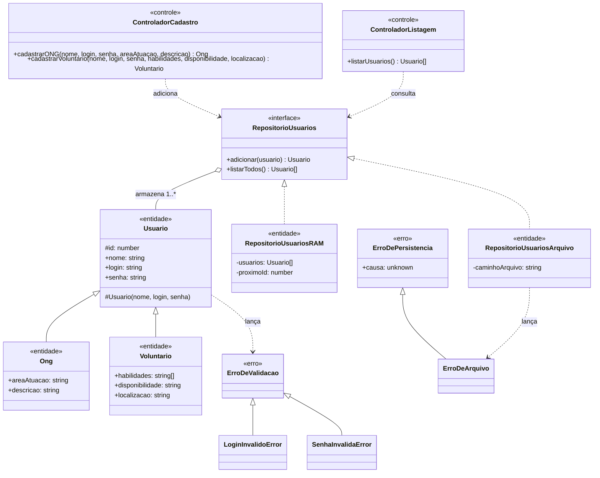

# Laboratório 2: Tratamento de Erros

Evolui o módulo de [Gerenciamento de Usuários](./gerenciamento-usuarios.md) com credenciais de acesso (login/senha) validadas por exceções próprias, e com um segundo mecanismo de persistência.

## Diagrama de Classes Atualizado



Uma função `criarRepositorioUsuarios(tipo, caminhoArquivo?)` (não é uma classe, por isso fora do diagrama) seleciona a implementação de `RepositorioUsuarios` no início da execução.

## Validação de credenciais

Aplicada no construtor de `Usuario` — toda `Ong` ou `Voluntario` nasce com credenciais válidas, não é possível criar uma instância inconsistente.

### Login

- Não pode ser vazio.
- No máximo 12 caracteres.
- Não pode conter números.

Violações lançam `LoginInvalidoError`.

### Senha

Segue a **política de senha padrão do AWS IAM** ([docs](https://docs.aws.amazon.com/pt_br/IAM/latest/UserGuide/id_credentials_passwords_account-policy.html)):

- Entre 8 e 128 caracteres.
- Ao menos 3 dos 4 tipos de caractere: maiúscula, minúscula, número, símbolo (`! @ # $ % ^ & * ( ) _ + - = [ ] { } | '`).
- Não pode ser idêntica ao login (equivalente ao "nome da conta" nas regras do IAM — não há e-mail neste modelo).

Violações lançam `SenhaInvalidaError`.

`LoginInvalidoError` e `SenhaInvalidaError` estendem a base `ErroDeValidacao` (que estende `Error`), permitindo capturar qualquer erro de validação de credencial genericamente ou tratar cada tipo especificamente.

## Persistência

Dois mecanismos, por trás da mesma interface `RepositorioUsuarios`:

| Mecanismo | Classe | Sobrevive a reinício? | Erro lançado em falha |
|---|---|---|---|
| Memória (RAM) | `RepositorioUsuariosRAM` | Não | — |
| Arquivo binário | `RepositorioUsuariosArquivo` | Sim | `ErroDeArquivo` (equivalente a um `IOException`) |

`RepositorioUsuariosArquivo` serializa a coleção com `node:v8` (`serialize`/`deserialize`) — um formato binário, não um JSON legível — relendo e regravando o arquivo inteiro a cada operação. Como a serialização v8 não preserva o protótipo das classes, cada leitura reconstrói `Ong`/`Voluntario` a partir dos campos do registro (discriminando pela presença de `areaAtuacao`).

### Selecionando o mecanismo na inicialização

```ts
import { criarRepositorioUsuarios } from './entidades/fabricaRepositorioUsuarios.js';

const repositorio = criarRepositorioUsuarios(); // RAM por padrão
// ou, via variáveis de ambiente:
//   PONTE_PERSISTENCIA=arquivo
//   PONTE_ARQUIVO_USUARIOS=usuarios.bin   (opcional, tem um padrão)
```

## Mapeamento para o código

| Elemento | Implementação |
|---|---|
| `Usuario`, `Ong`, `Voluntario` | [`src/entidades/`](../../src/entidades/) |
| `RepositorioUsuarios` (interface) | [`src/entidades/RepositorioUsuarios.ts`](../../src/entidades/RepositorioUsuarios.ts) |
| `RepositorioUsuariosRAM` | [`src/entidades/RepositorioUsuariosRAM.ts`](../../src/entidades/RepositorioUsuariosRAM.ts) |
| `RepositorioUsuariosArquivo` | [`src/entidades/RepositorioUsuariosArquivo.ts`](../../src/entidades/RepositorioUsuariosArquivo.ts) |
| `criarRepositorioUsuarios` (fábrica) | [`src/entidades/fabricaRepositorioUsuarios.ts`](../../src/entidades/fabricaRepositorioUsuarios.ts) |
| `validarLogin`, `validarSenha` | [`src/entidades/validacao/ValidadorCredenciais.ts`](../../src/entidades/validacao/ValidadorCredenciais.ts) |
| `ErroDeValidacao`, `LoginInvalidoError`, `SenhaInvalidaError` | [`src/entidades/erros/ErroDeValidacao.ts`](../../src/entidades/erros/ErroDeValidacao.ts) |
| `ErroDePersistencia`, `ErroDeArquivo` | [`src/entidades/erros/ErroDePersistencia.ts`](../../src/entidades/erros/ErroDePersistencia.ts) |
